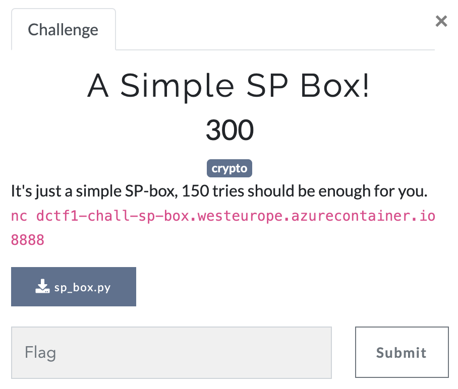
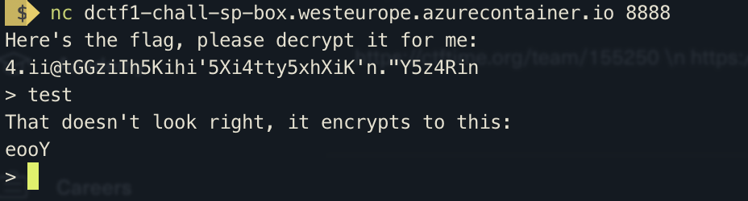

A Simple SP Box!
==================



We are given a netcat adress + port and the python script which is running on it.

Let's check out what they want us to solve first:



So we are given the flag encrypted and need to decrypt it. But there is more, we can actually see what our input translates to.

Let's have a look at the provided script:

```py
def play():
    print("Here's the flag, please decrypt it for me:")
    print(encrypt(flag))

    for _ in range(150):
        guess = input("> ").strip()
        assert 0 < len(guess) <= 10000

        if guess == flag:
            print("Well done. The flag is:")
            print(flag)
            break
```
okay so here is the check whether we put in the right flag or not. Our input is the guess.
We also only have 150 tries to get it right.

The flag however is encrypted with the encrypt-function so let's what that one is doing.

```py
def encrypt(message):
    if len(message) % 2:
        message += "_"
```
So first it checks if the message, which is the flag in our case has an even length, if not it appends an underscore. So in the following the message always has an even length.

```py
	message = list(message)
	rounds = int(2 * ceil(log(len(message), 2))) 

	for round in range(rounds):
	    message = [S_box[c] for c in message]
	    if round < (rounds-1):
	        message =  [message[i] for i in range(len(message)) if i%2 == 1] + [message[i] for i in range(len(message)) if i%2 == 0]
	return ''.join(message)
```

Afterwards it converts the message into a list-object and calculates how many "rounds" it is going to encrypt it. We don't need to understand how many rounds exactly it will be done, but we can see because of the 2* it's always an even amount of rounds. This will help us in the following.

It then maps the message with another alphabet S_box and scrambles it up by shifting every 2nd letter to the front and returns the encrypted message afterwards.

```py
ALPHABET = ascii_letters + digits + "_!@#$%.'\"+:;<=}{"
shuffled = list(ALPHABET)

random.shuffle(shuffled) 
S_box = {k : v for k, v in zip(ALPHABET, shuffled)} 
```
So S_box is a random alphabet calculated at the beginning.
If we can get the random alphabet we can use it to reverse the encryption.

We wrote a short python script to solve it for us.

First we solve the shuffled alphabet in the current session. We can do that by just sending every letter twice: "AA" for example.
Usually this wouldn't help a lot, because it get encrypted multiple rounds, however in this specific case we know one thing for sure: it always get's encrypted an even number. If we send every letter twice we always know what our sent letter was before two rounds of encryption. 

```py
for character in ALPHABET:
	nc.send(character*2+'\n')
	recv = nc.recv_until(start.encode('utf-8'))
	a, newchar, b = recv.splitlines()
	newchar = newchar.decode('utf-8')
	newchar = newchar[1]
	newlist.append(newchar)


NEW_ALPHABET = {k : v for k, v in zip(ALPHABET, newlist)}
```
After we built or alphabet "NEW_ALPHABET" which represents the input before two times of encryption, we can use it to decrypt the received flag half the "rounds" it got encrypted and send it to the server to verify it.

```py
def decrypt(cipher):
	newcipher = ""
	for character in cipher:
		position = newlist.index(character)
		trans = ALPHABET[position]
		newcipher = newcipher + trans
	return newcipher

rounds = int(2*ceil(log(len(flag), 2)))

rounds = int(rounds/2)


for round in range(rounds):
	if round < (rounds):
		flag = decrypt(flag)
		print(str(round) + ' ' + flag)

nc.send(flag+'\n')
print(flag)
```

We now have the flag but still in shifted format. So we just turn it back:

```py
message = flag

while True:
	message =  [message[i] for i in range(len(message)) if i%2 == 1] + [message[i] for i in range(len(message)) if i%2 == 0]
	message = ''.join(message)
	if message[:4] == 'dctf':
		print(message)
		break

recv = nc.recv_all()
print(recv.decode('utf-8'))
```
[The full script](A_simple_SP_BOX.py)


