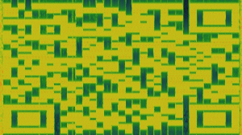

Bad Apple
==================

We are given a .mp4 file. 

Looking at it'S spectrogram with Sonic Visualizer reveals this QR-Code.

Now we just cropped it, adjusted contrast and color and scanned it with a QR-Code-Scanner.

