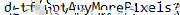

Behind the scenes
==================


We can see a blurred password on the open notepad on a windows10 mashine.
We remembered seeing this recently on Twitter:

https://twitter.com/spibblez/status/1335638633970348032

So first thing was to crop it.
But careful to get all the pixels.


Now we used Depix: https://github.com/beurtschipper/Depix
with these parameters:

```
python depix.py -p cropped.png -s images/searchimages/debruinseq_notepad_Windows10_closeAndSpaced.png -o output.png
```

Unfortunately there was a problem with the challenge during this CTF. So even though this is the intended way it didn't give the expected output.
We were given the expected output by the organisers after proving we tried the right thing.

