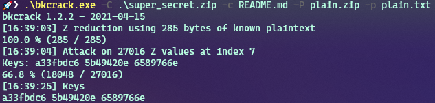

Company Leak
==================

We are given a README.md and a super_secret.zip which is encrypted with an unknown key.


We can't see the actual content of the files inside of the encrytped.zip, however we can see the titles of the files.


So there is another README.md inside the encrypted zip. We assume, as title and size matches that those are the same.

All we have to do now is performing a so called "known plaintext attack".
We figured that this tool works best:

https://github.com/kimci86/bkcrack

To make it run we need our plaintext to be compressed to a non-encrypted zip aswell, so after creating a plain.zip with the plaintext README.md we can run the tool:

```
./bkcrack -C ../super_secret.zip -c README.md -P ../plain.zip -p README.md
```

which give us the keys:



Now we can use these keys and the tool again to create a new zip with our own password, for example "easy"

```
./bkcrack -C ../super_secret.zip -k a33fbdc5 5b49420e 6589766e -U new_zip.zip easy
```

