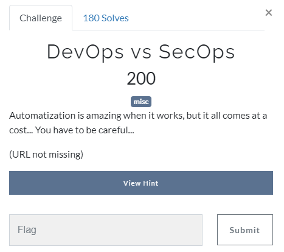
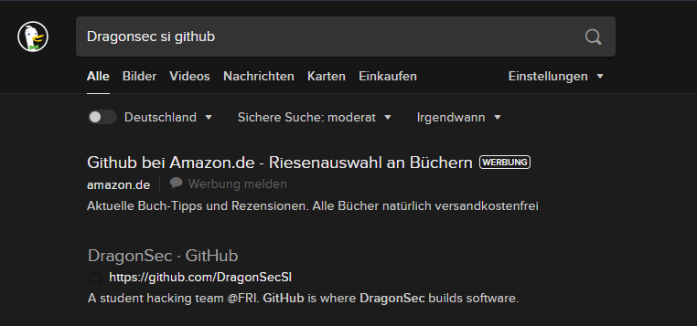
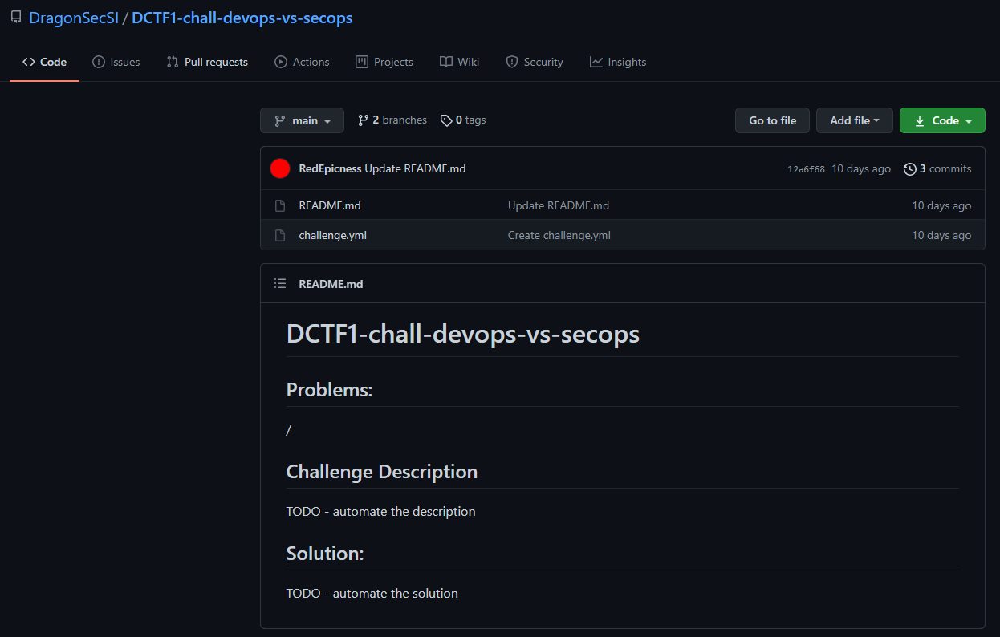
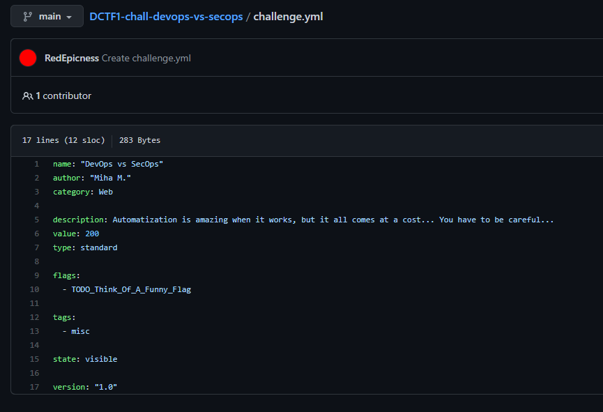
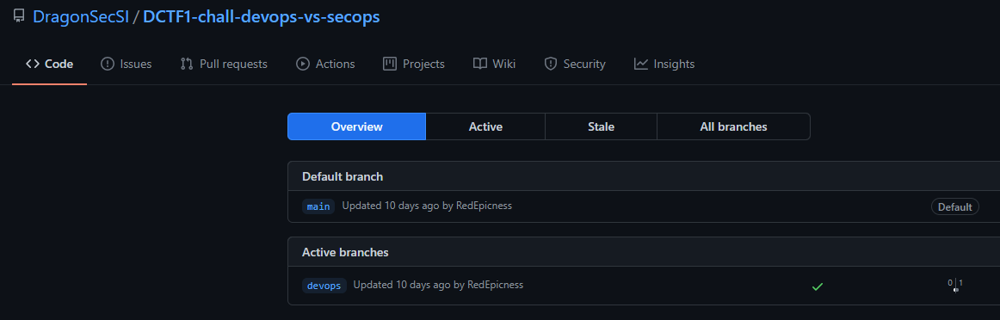
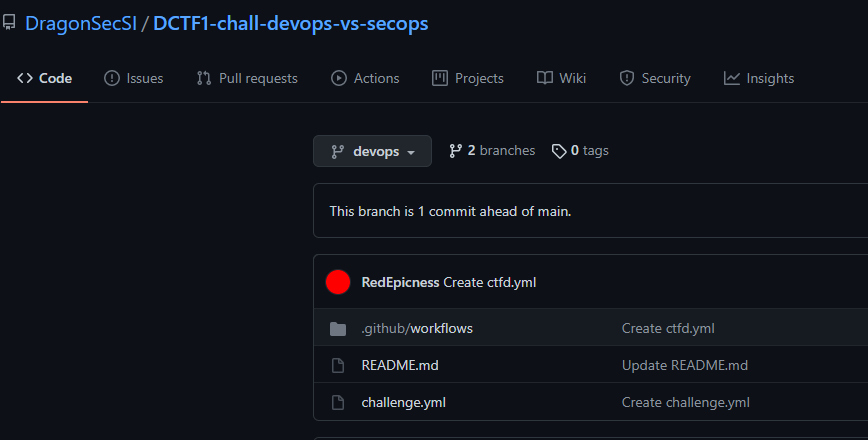
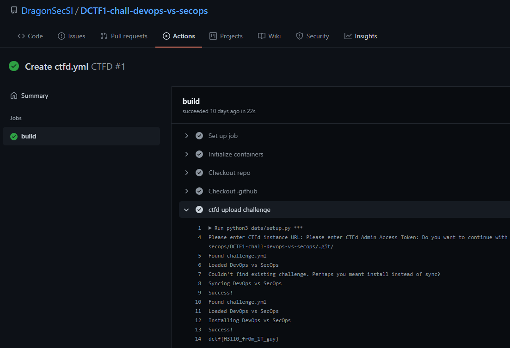

Devops vs secops
====================
#very similar to challenge "Leak Spin"

Tbh we found this flag during the same search we did in challenge Leak Spin but to be correct we will show you all the steps.

A quick search reveals:
https://github.com/DragonSecSI

Now we know that DragonSec has some GitHub repos online.
One repository is called like our challenge:

At this point we need to dig a little bit further than in Leak Spin because we can't see a flag in the files here:

Searching again in the repo (picture above) you can see that there are 2 branches.
The other branch besides main is called devops:

The repo looks like:

Again we could'nt find the flag in the yml. But there is a new folder called workflows.
The folder contains a ctfd.yml but there is nothing of interest in it.
But in the Actions tab of the workflow we found what we needed:

