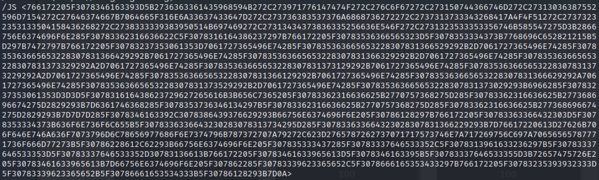
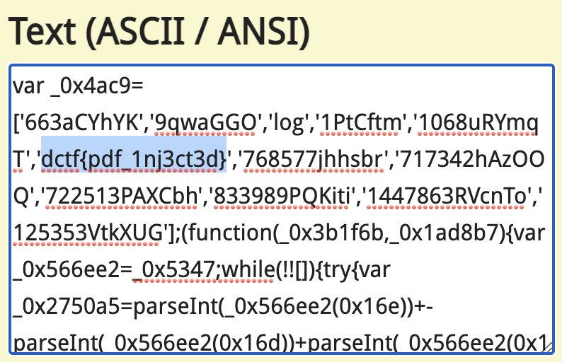

Don't let it run
==================

We are given a [pdf file](dragon.pdf).

Running a simple strings command on it already reveals some interesting data:

```
strings -n 7 dragon.pdf
```


converting this hex to ascii reveals the flag:



