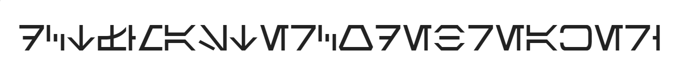
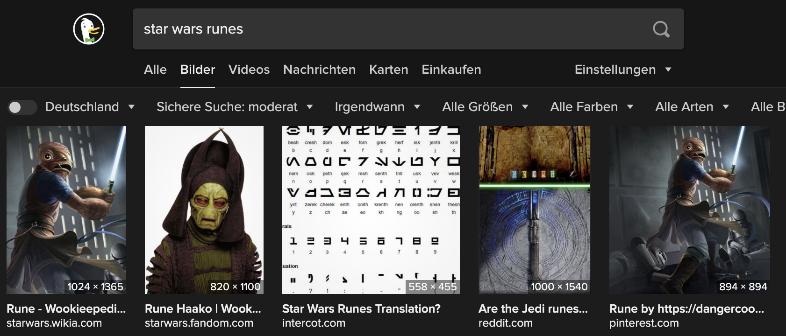
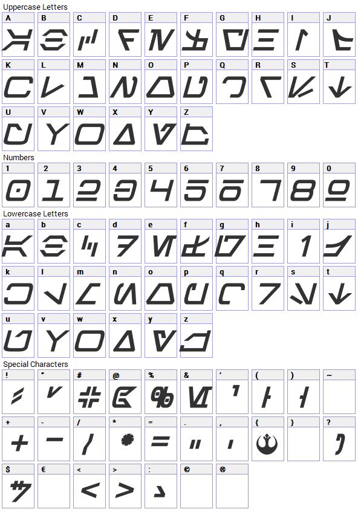

Encrypted the flag I have
==================

We are given this PNG.

This looked really Sci-Fi-like so we assumed this has to be from a video game or something like that, the title of the challenge already sounded like Yoda so we just searched for Star Wars Runes and got the result.

Now just decode by hand.

