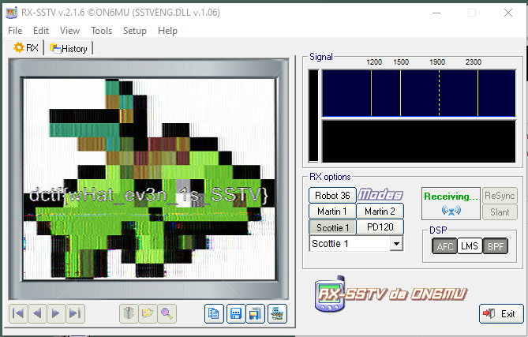

Extraterrestial Communication
=============

We are given a sound file: [A_message_from_outer_space](sources/A_message_from_outer_space.mp3)

Listening to the mp3 it sounds like modulation of some data.

After guessing and searching for the carrier and the baud rate we tried to use [minimodem](https://github.com/kamalmostafa/minimodem) but couldn't get anything.

After rereading the Challenge and the name of the file we searched for space communications in the past and finally got to "SSTV".
You can download a SSTV-Reciever at: [RX-SSTV](https://oe5lxr.at/decode-sstv-with-mmsstv/)

Refiguring the output of your media player to the in input of the reciever or just by playing with another device and recording with your microphone you will get the flag:

