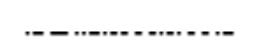
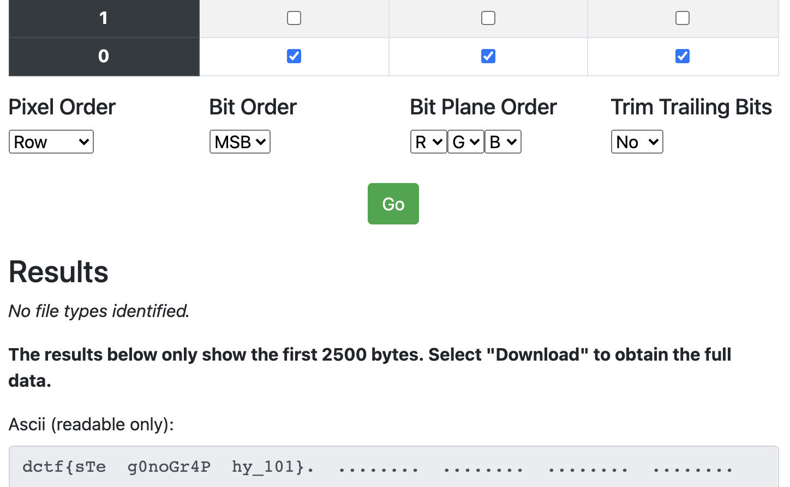

Hidden message
==================

So we are given a PNG of the EU Parlament in Strasbourg:

So we do our basic routine when it comes to check PNG files for steganography. Which includes [StegOnline](https://stegonline.georgeom.net/).

After uploading the pictures we browse the bit planes and can already see something unusual in the Red 0, Blue 0 and Green 0 layers.

So we switch to "Extract Data" and select the Layers 0 of R G and B.

And there is our flag already.

