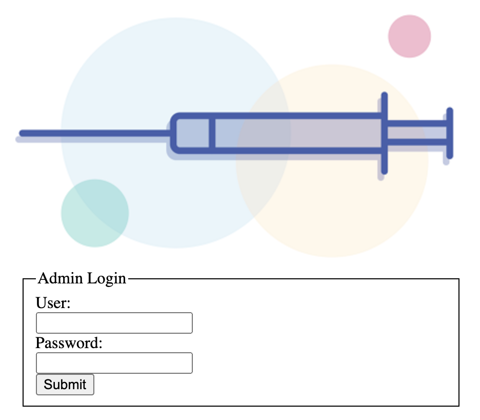
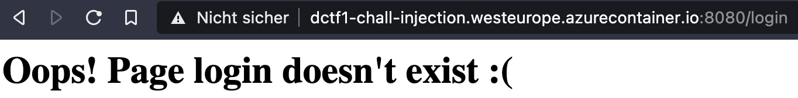
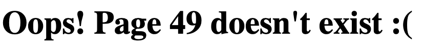
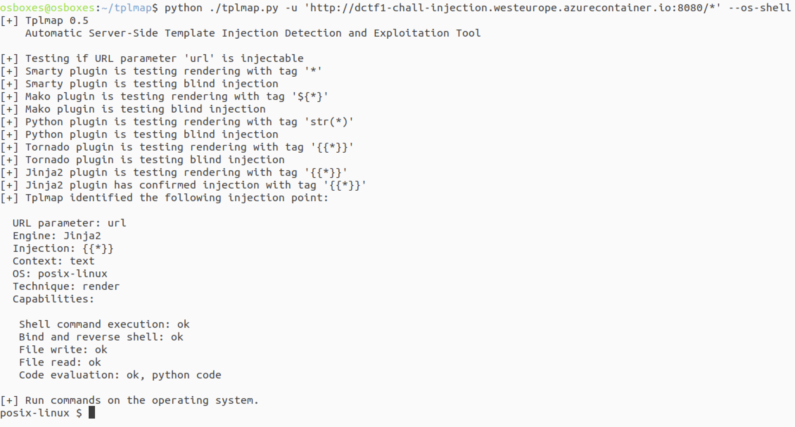
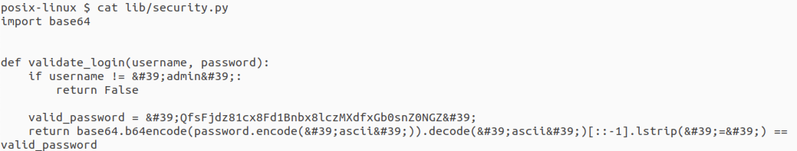
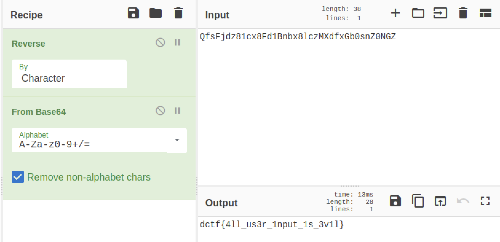

Injection
==================

At first glance we just have a regular login page. However when we try to login we get the folliwing error:

Looks like the page "login" can't be found. The name of the challenge is "Injection" already and this looks a lot like it so let's try Url-Injection and try to reach: http://dctf1-chall-injection.westeurope.azurecontainer.io:8080/{{7*7}}

Interesting we got execution, so let's fire up [tplmap](https://github.com/epinna/tplmap) and try to spawn a shell:

Sweet, after a short enumeration we find an interesting file in ./lib let's have a lookt at it:

Looks like there is a string that got base64 encoded and reversed afterwards as a password, let's use [CyberChef](https://gchq.github.io/CyberChef/) to revert that:

