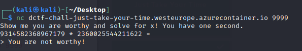
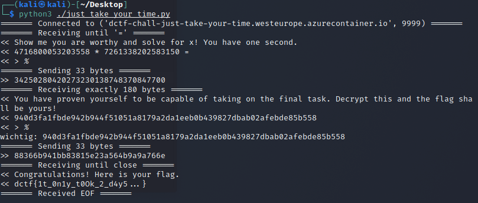

Just Take Your Time
====================

Looking at the [code](source/orig_just-take-your-time.py) this challange needs us to first calculate a product and than decrypting some DES.

Connecting with NC looks like:



We don't have much time because it answeres "You are not worthy" very fast so we need to set up a [script](source/just_take_your_time.py):

```py
#!/usr/bin/python
# Just take your time DCTF

import itertools
import nclib
import sys
import collections
from Crypto.Cipher import DES3
from time import time

key = str(int(time())).zfill(16).encode("utf-8")
cipher = DES3.new(key, DES3.MODE_CFB, b"00000000")

### connecting to the socket and recieving until the '=':
nc = nclib.Netcat(('dctf-chall-just-take-your-time.westeurope.azurecontainer.io', 9999), verbose=True)
start = "="
recv = nc.recv_until(start.encode('utf-8'))
a, ding  = recv.splitlines()

ding=ding.decode()

###Getting the factors from recv:
x = int(ding.split(' ')[0])
y = int(ding.split(' ')[2])

###Calculating and answering:
z=x*y
z = str(z)
nc.send(z + '\n')


###Recieving the next part - decryption
recv = nc.recv_exactly(180)
a, b, wichtig, c  = recv.splitlines()
wichtig = wichtig.decode()
print('wichtig: ' + wichtig)
wichtig = bytes.fromhex(wichtig)

###decrypting the RES and sending back
decr = cipher.decrypt(wichtig)
nc.send(decr + b'\n')


nc.recv_all()
```

The little script solved the calculation and the following DES and recieved the flag:


