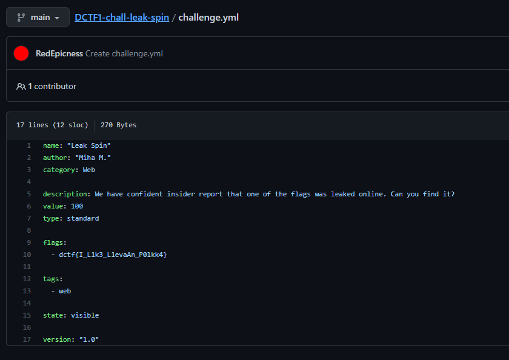

Leak Spin
===================
#very similar to challenge "devops vs secops"

This description sounds like an OSINT challange. 

A quick search reveals:
https://github.com/DragonSecSI

Now we know that DragonSec has some GitHub repos online.
One repository is called like our challenge:

The repo contains a file called challange.yml. Here we find the flag:

