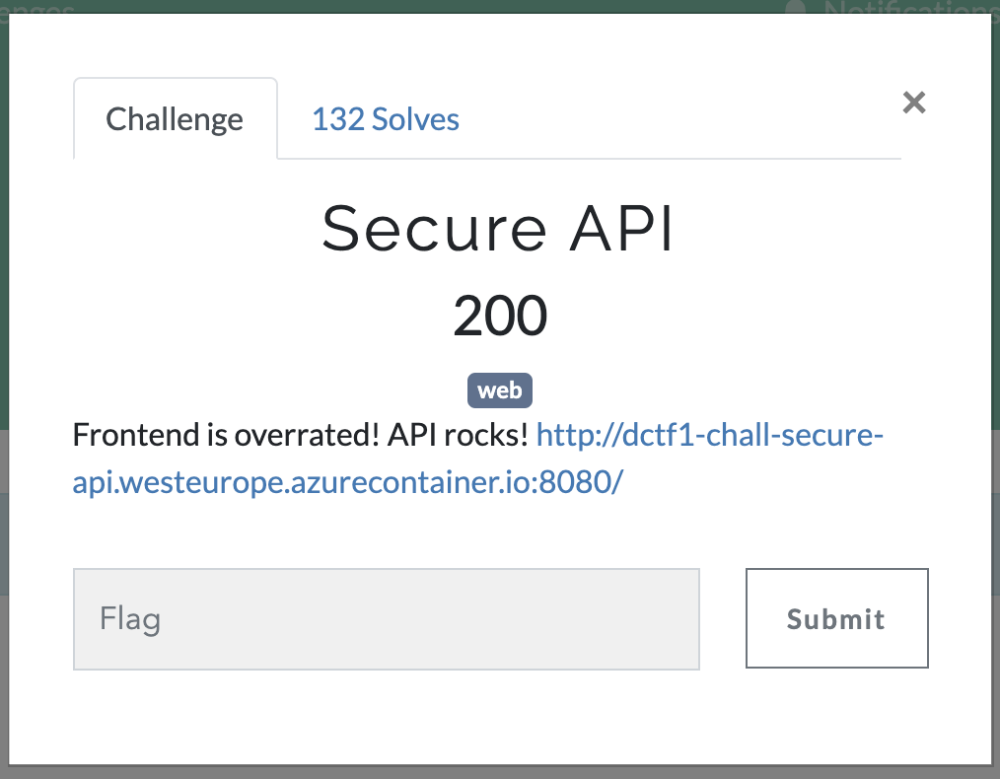
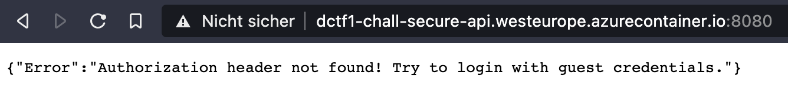
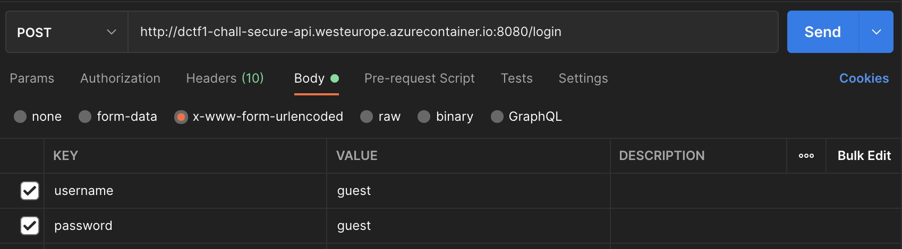
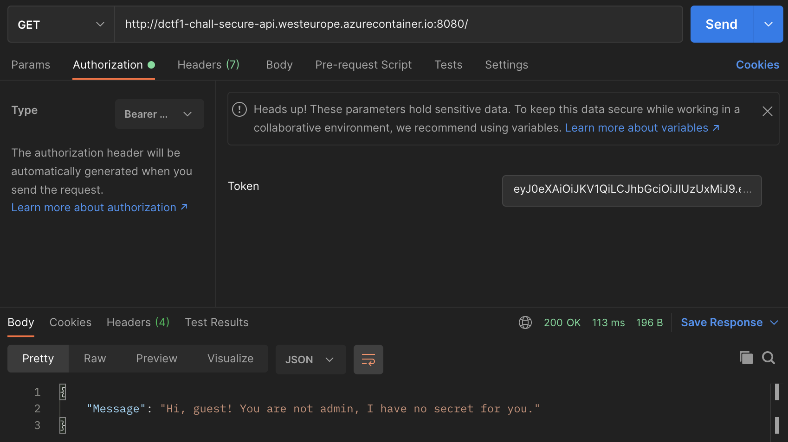
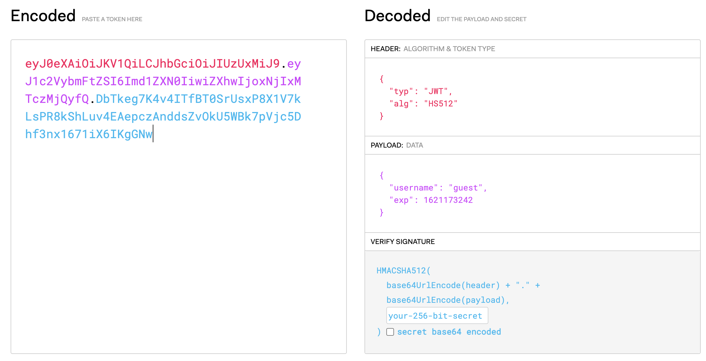
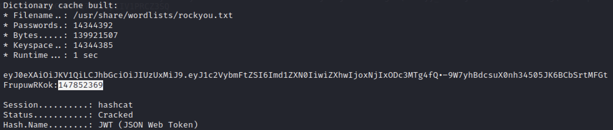
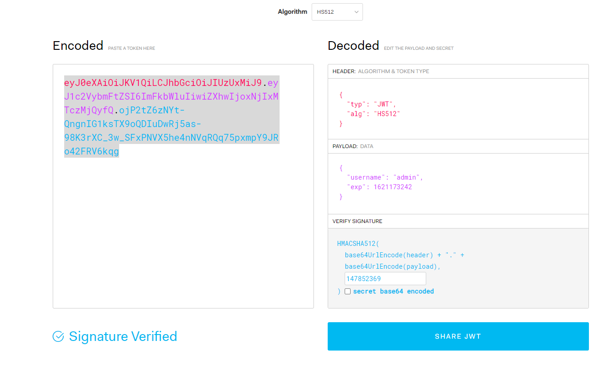
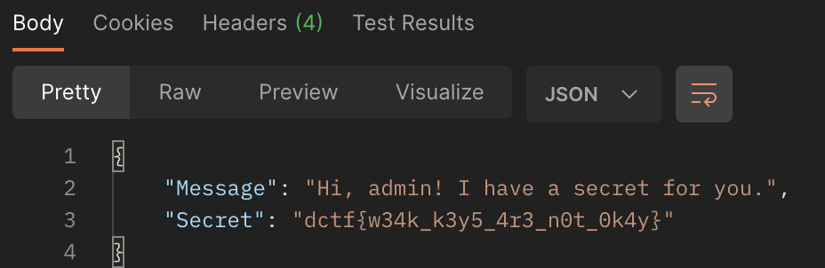

Secure API
==================



So let's open in it a browser or curl it to see what we have here:



Okay we aren't authorized however it tells us to try it with guest credentials. So let's send a POST to /login with guest:guest creds in the body:



and check the response:


Alright we get a JWT token so let's send that to the API to authorize:



Okay great we are authorized as guest, but we won't get the secret unless we are admin.
Let's have a look at our token, we use the site http://jwt.io for that:



So the token pretty much only has the username: guest, but we can't just change it because we wouldn't have a valid signature then. So let's try to crack it with hashcat:

```
hashcat -m 16500 token.txt /usr/share/wordlists/rockyou.txt 
```



So let's use that key to forge a new token with the username admin:



and send it to the API:




