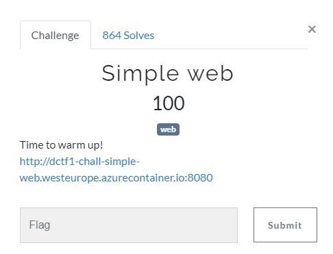
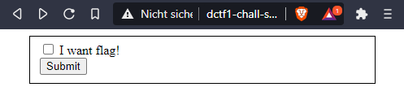
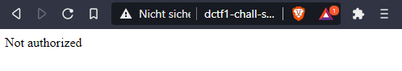
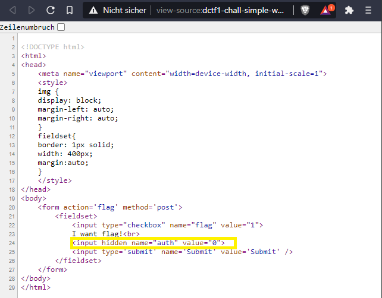
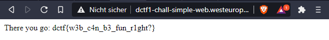

Simple Web
=================

We are given a web page:

Regardless the box is checked or not we get:

First step that comes in mind is getting a look at the html-form in the source code:

Here we see a hidden input called "auth" with a value set to 0. Just by setting it to 1 and hitting the checkbox and the Submit button we get the flag:

