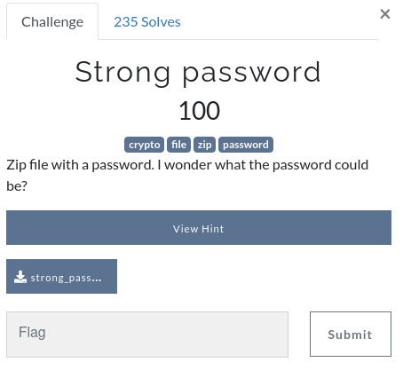
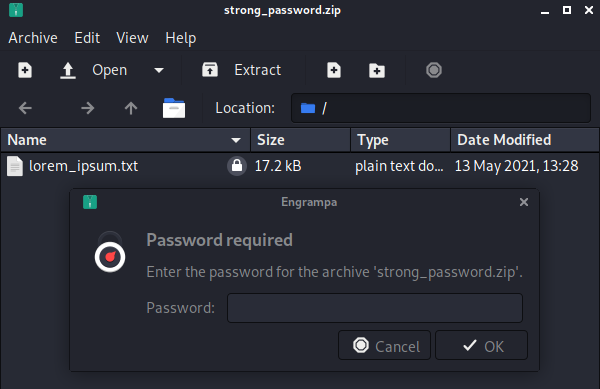
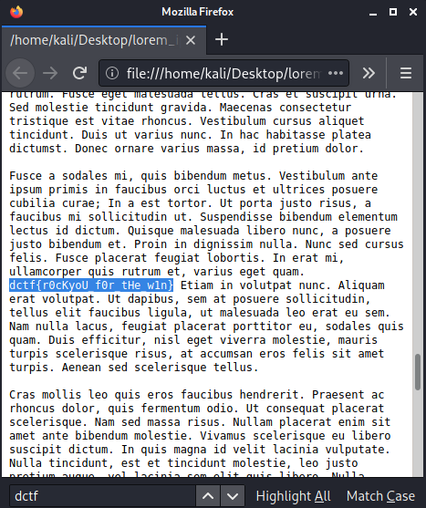

Strong Password
===================


We are given a zip file. Inside we can see a lorem_ipsum.txt but we can't extract anything without a password.



At first we can try john to generate a hash and crack it. Therefore we have to generate the hash:

```
$ zip2john ./strong_password.zip > john.txt  
ver 2.0 efh 9901 strong_password.zip/lorem_ipsum.txt PKZIP Encr: cmplen=5171, decmplen=17174, crc=CEFA3672

```

Now we can try to crack the hash with a common wordlist:

```
$ john ./john.txt -w ./rockyou.txt
...
Using default input encoding: UTF-8
Loaded 1 password hash (ZIP, WinZip [PBKDF2-SHA1 128/128 AVX 4x])
No password hashes left to crack (see FAQ)
```

To get the password we can use:
```
$ john ./john.txt --show           
strong_password.zip/lorem_ipsum.txt:Bo38AkRcE600X8DbK3600:lorem_ipsum.txt:strong_password.zip:./strong_password.zip

1 password hash cracked, 0 left

```

So john already got us the password 'Bo38AkRcE600X8DbK3600' to extract the zip file.
Inside the extracted lorem_ipsum.txt we find our flag:


