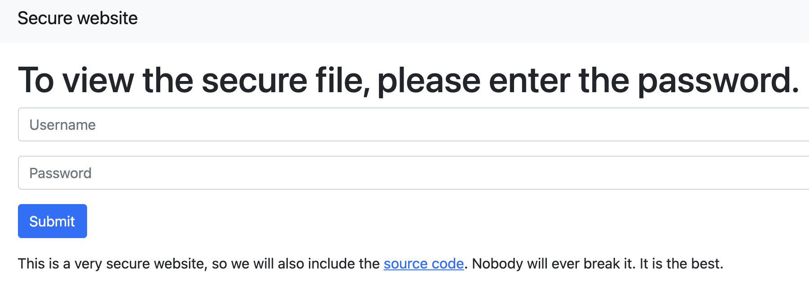
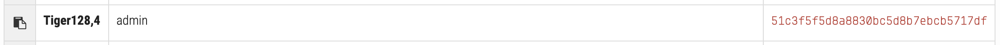

Very secure website
==================



They also give us the source code:

```php
<?php
    if (isset($_GET['username']) and isset($_GET['password'])) {
        if (hash("tiger128,4", $_GET['username']) != "51c3f5f5d8a8830bc5d8b7ebcb5717df") {
            echo "Invalid username";
        }
        else if (hash("tiger128,4", $_GET['password']) == "0e132798983807237937411964085731") {
            $flag = fopen("flag.txt", "r") or die("Cannot open file");
            echo fread($flag, filesize("flag.txt"));
            fclose($flag);
        }
        else {
            echo "Try harder";
        }
    }
    else {
        echo "Invalid parameters";
    }
?>
```

So we can see our two hashes for username and password.
We use https://md5hashing.net/hash/tiger128,4 to crack our username hash which translates to "admin":



However we can't do that for our password. But what we can do is realizing that they only use a equal-equal operator (==) to compare the hash to the password. And we also know that any string starting with a "0e" in PHP is essential a "0" when compared with an equal-equal operator (for reference: https://www.whitehatsec.com/blog/magic-hashes/). So all we need to is find another string that translated to 0. These are calles "magic hashes" and can be found on this repo for example: https://github.com/spaze/hashes

So we can just login using these credentials:
```
username: admin
password: LnFwjYqB
```
and we are presented the flag.

