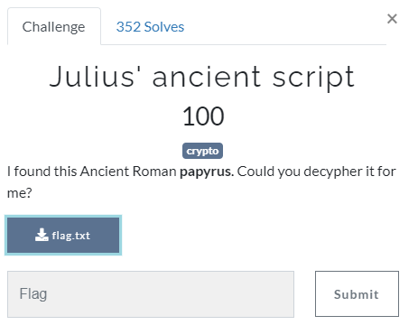
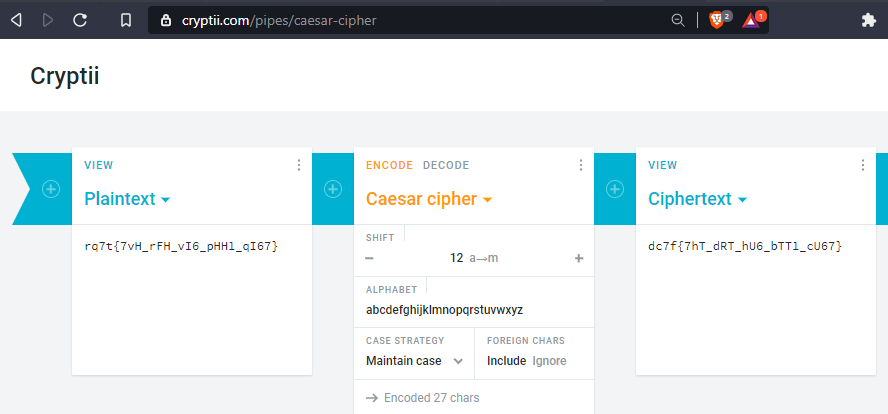

Julius' ancient script
===================


We are given a flag.txt that contains:
```
rq7t{7vH_rFH_vI6_pHH1_qI67}
```

With the words "Julius" and "ancient" and the format of the flag it seems to be a Caesar cipher.
There are several websites offering a decryption of the Caesar cipher like: https://cryptii.com/pipes/caesar-cipher

Putting our flag into the decrypor we get:

```
dc7f{7hT_dRT_hU6_bTT1_cU67}
```
We recognize the beginning of the flag "dctf" already but it's not fully decrypted yet. 
There are just a few translations left so we can continue manually:

To translate dc7f in dctf it seems like that numbers translate to lower case letters.
7 --> t:
```
dctf{thT_dRT_hU6_bTT1_cU6t}
```
One step backwards from 7 to 6 (t to s):
6 --> s
```
dctf{thT_dRT_hUs_bTT1_cUst}
```
And five steps backwards from 6 to 1 (s to n):
1 --> n
```
dctf{thT_dRT_hUs_bTTn_cUst}
```
Now there are only upper case letters left. Because we translated from numbers to lower case letters we will translate the upper case letters to numbers to fullfill the shifting circle.
Looking at 'thT' and 'bTTn' it seems like we need to get 'th3' ('the') and 'b33n' (been) here:
T --> 3
```
dctf{th3_dRT_hUs_b33n_cUst}
```

With one step forwards from T to U (3 to 4):
U --> 4
```
dctf{th3_dR3_h4s_b33n_c4st}
```
and two steps backwards from T to R (3 to 1):
R --> 1
```
dctf{th3_d13_h4s_b33n_c4st}
```
we finally translated the whole flag.
